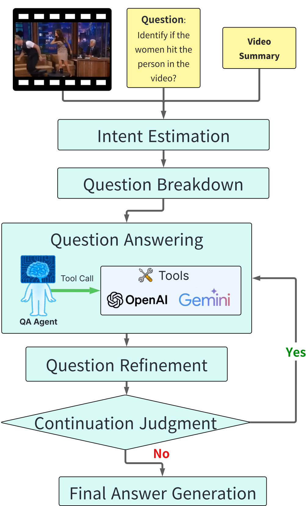

# DIVE: Deep-search Iterative Video Exploration

A winning solution for the CVRR (Complex Video Reasoning & Robustness Evaluation) Challenge at CVPR 2025🏆

[](https://arxiv.org/abs/1234.56789)
[](/docker)
[](#)

<p align="center">
    
</p>


## Overview
DIVE(Deep-search Iterative Video Exploration) is an advanced Video Question Answering (VQA) method that won 1st place at the CVRR-ES Challenge (CVPR 2025).
Our method uses an iterative approach and question breakdown to handle complex queries about videos, delivering accurate and context-aware answers.
Features include object-centric video summarization, agent-based analysis with multiple tools, and strong results on diverse, real-world video datasets.


<p align="center">
  <a>
    
  </a>
</p>


## 📊 Performance
Our method, DIVE (Deep-search Iterative Video Exploration), achieved 1st place in the CVRR-ES Challenge at CVPR 2025.

- 🥇 Test Accuracy: 81.44% (see Official [leaderboard](https://www.crcv.ucf.edu/cvpr2025-vidllms-workshop/leaderboards.html))

- ✅ Validation Accuracy: 91.54% (see EvalAI [leaderboard](https://eval.ai/web/challenges/challenge-page/2480/leaderboard/6153))

- 📈 Outperformed all other participants and strong baselines, including GPT-4V (70.78%) and GPT-4o (75.03%).

DIVE's strong performance comes from three core components:

- Breakdown Question module: Decomposes each complex question into semantically meaningful sub-questions, enabling targeted and stepwise analysis.

- Intent Estimation: Identifies the underlying purpose behind the question by jointly analyzing the video and language context.

- Video Summarization: Uses object-centric summaries based on visual detection to provide interpretable, context-rich input for downstream reasoning.

These modules work together in an iterative loop, allowing DIVE to deliver accurate and contextually grounded answers even for highly challenging queries.


## 🚀How To Use

## 📂Dataset Preparation
### Step1. Downloading and Setting Up CVRR-ES Dataset

Set up the CVRR-ES dataset by following the below steps.
1) CVRR-ES dataset can be downloaded [using this link (zipped)](https://mbzuaiac-my.sharepoint.com/:f:/g/personal/uzair_khattak_mbzuai_ac_ae/EktDA83_8UxJrc23DQfrfv8Bvw41YxWVBgD3Fapxs69rRg?e=8Nm0Rf). CVRR-ES benchmark consists of 2400 open-ended question-answer (QA) pairs spanning over 214 unique videos and covers 11 diverse evaluation dimensions.
After unzipping, the CVRR-ES dataset structure looks like the following:

```
CVRR-ES/
|–– interpretation_of_visual_context/
|   |–– annotations_interpretation_of_visual_context.json
|   |–– captions_interpretation_of_visual_context.json
|   |–– 163.mp4
|   |–– ... # remaining videos
|–– partial_actions/
|   |–– annotations_partial_actions.json
|   |–– captions_partial_actions.json
|   |–– 121.mp4
|   |–– ... # remaining videos
|–– unusual_and_physically_anomalous_activities/
|   |–– annotations_interpretation_of_visual_counusual_and_physically_anomalous_activities.json
|   |–– captions_unusual_and_physically_anomalous_activities.json
|   |–– 101.mp4
|   |–– ... # remaining videos
... # remaining video-evaluation dimension folders
```

Here, each folder corresponds to a single video evaluation dimension and contains annotations (QA pairs and captions) alongside videos.

Now note that videos utilized from [Something-Something V2 Dataset](https://developer.qualcomm.com/software/ai-datasets/something-something) (SSv2) have been not included in the zipped folder due to copyright policies. In order to complete the dataset, first:

2) Download SSv2 dataset from [official website](https://developer.qualcomm.com/software/ai-datasets/something-something) (it is publicly available). You will be prompted to register yourself by creating an account.

3) Identify the videos for CVRR-ES dataset by retrieving the videos with ids given in [this text file](assets/ssv2_videos.csv).
4) Rename the videos following the mapping in the text file and add them to their respective evaluation dimension folder in the unzipped CVRR-ES folder.


### Step2. Extracting Frames from Videos
To extract frames from the videos, you can use the `extract_video_frames.py` script provided in this repository. This script will extract frames from each video and save them in a specified directory.
```bash
python3 extract_video_frames.py
```


## 🧠Google Cloud Setup
### Step1. You need to set up authentication credentials to use VertexAI.

- Method 1: Using a Service Account

    Create a service account from the GCP Console and set the environment variable to the path of the credentials JSON file.
    ```bash
    export GOOGLE_APPLICATION_CREDENTIALS=/path/to/credentials.json
    ```

- Method 2: Set up ADC with User Account
    ```bash
    gcloud auth application-default login
    ```

    With this method, you may receive quota warnings. To suppress these warnings, explicitly set the quota project using the following command:
    ```bash
    gcloud auth application-default set-quota-project GCP_PROJECT_ID
    ```

### Step2. Set up Google Cloud Storage Bucket
You need to create a Google Cloud Storage bucket to store the Video data of the CVRR-ES dataset. You can create a bucket using the GCP Console.

After creating the bucket, you need to upload the CVRR-ES dataset videos to the bucket. The structure of the bucket should look like this:
```
YOUR_BUCKET_NAME/
|–– interpretation_of_visual_context/
|   |–– XXXX.mp4
|–– partial_actions/
|   |–– XXXX.mp4
|–– unusual_and_physically_anomalous_activities/
|   |–– XXXX.mp4
... # remaining video-evaluation dimension folders
```


## 🧠OpenAI Setup
You need to set up your OpenAI API key to use the OpenAI API for generating responses.

You can set the API key as an environment variable:
```bash
export OPENAI_API_KEY=your_openai_api_key
```


## 📋Video Summary Generation

DIVE uses object-centric video summaries based on visual detection to provide interpretable, context-rich input for downstream reasoning. The video summary generation process consists of two main steps: object detection and video summarization.

### Object Detection
The system uses Grounding DINO for zero-shot object detection across video frames:
- **Model**: IDEA-Research/grounding-dino-base
- **Process**: Analyzes sampled frames to identify relevant objects using GPT-4.1 vision analysis
- **Output**: CSV files containing frame-by-frame object detection results with bounding boxes and confidence scores

### Video Summarization
The summarization process integrates object detection results with visual analysis:
- **Input**: Object detection CSV data + sampled video frames
- **Model**: OpenAI GPT-4.1
- **Features**:
  - Chronological event tracking with explicit frame numbers
  - Object behavior analysis and temporal patterns
  - Scene transition detection
  - Integration of detection data with visual cues

### Generating Video Summaries

To generate video summaries for your dataset, use the `generate_video_summary.py` script:

```bash
python generate_video_summary.py \
    --cvrr_dataset_path /path/to/CVRR-ES \
    --image_base_path /path/to/extracted/frames \
    --output_dir /path/to/output
```

**Output Files:**
For each video, the script generates:
- `{video_id}.csv`: Object detection results in CSV format
- `{video_id}.json`: Raw object detection data in JSON format
- `{video_id}.txt`: Generated video summary text
- `{video_id}_objects.txt`: List of detected object classes

**Configuration:**
The system uses the following default settings (configurable in `Config` class):
- **Frame sampling**: 32 frames per video using divisor-based sampling
- **Detection thresholds**: Box threshold 0.3, Text threshold 0.25
- **CSV limit**: Maximum 4000 lines for efficient processing
- **GPU support**: Automatic CUDA detection for faster processing

### Pre-generated Summary Data
Alternatively, you can download pre-generated video summary data from this [link](#) to skip the generation step.


## 🐋Docker Setup
Before running the code, you need to set up the environment variables for Google Cloud and OpenAI. You can do this by creating a `.env` file in the `docker` directory.
```
GOOGLE_CLOUD_PROJECT=gcp_project_id
GOOGLE_CLOUD_LOCATION=region
GOOGLE_CLOUD_BUCKET_NAME=bucket_name
GOOGLE_APPLICATION_CREDENTIALS=/path/to/your/credentials.json
OPENAI_API_KEY=your_openai_api_key
```

To run the code in a Docker container, you can use the provided Dockerfile. Follow these steps:

```bash
cd docker
docker compose build
```


## 🚀Execute the DIVE

To execute the DIVE, you can use the `main.py` script. This script will process the CVRR-ES dataset and generate the results.
You can run the DIVE with the following command:
```bash
python3 main.py \
    --cvrr_dataset_path CVRR_DATASET_PATH \
    --image_base_path IMAGE_BASE_PATH \
    --video_summary_path VIDEO_SUMMARY_PATH \
    --output_dir OUTPUT_DIR \
    --num_frames NUM_FRAMES \
    --processes NUM_PROCESSES \
    --resume
```

To evaluate the results, you can use the official evaluation script provided in the CVRR-ES dataset. The evaluation script will compare the generated responses with the ground truth annotations and calculate the scores for each evaluation dimension.

please refer to the [CVRR-Evaluation-Suite](https://github.com/mbzuai-oryx/CVRR-Evaluation-Suite) for more details.


## ✅Citation
If you find our work and this repository useful, please consider giving our repo a star and citing our paper as follows:
```bibtex
@article{XXXXXXXXXX,
    title={DIVE: Deep-search Iterative Video Exploration A Technical Report for the CVRR Challenge at CVPR 2025},
    author={Umihiro Kamoto, Tatsuya Ishibashi, Noriyuki Kugo},
    journal={arXiv:xxxx.xxxx},
    year={2025}
}
```

## 💬Contact
If you have any questions, please create an issue on this repository or contact at kamoto.umihiro@jp.panasonic.com.
